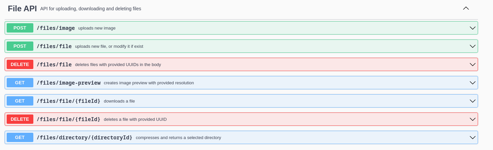
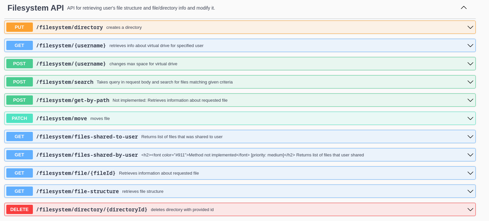
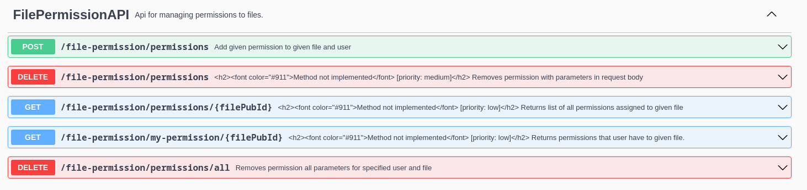
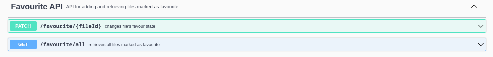
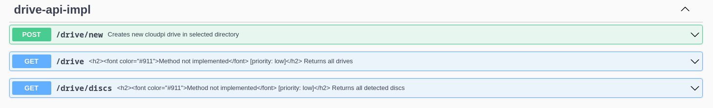
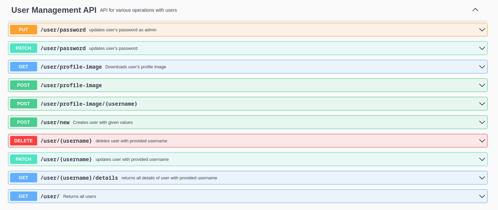
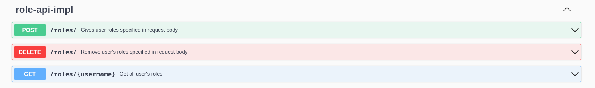
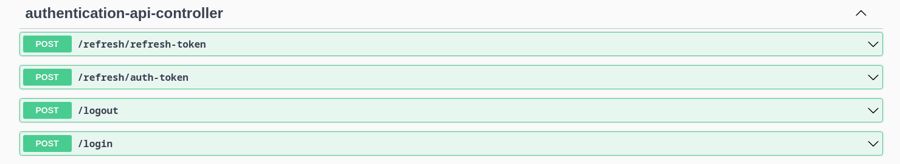

    

# CloudPi - RaspberryPi based cloud drive
## CloudPi Project
CloudPi is project aiming to create home cloud storage that can be run at RaspberryPi
microcomputer. Project was developed during "Team Project" classes at the 
Warsaw University of Technology by team of 5 people.

## Team
Project was developed by 5 people.  
Backend was done by:
- Kamil Wójcik
- Kacper Hołubowicz

Frontend was done by:
- Kamil Sztandur
- Kuba Grenda
- \------ ----------

## About this repository
This is repository for backend of project called Raspberry. 
Project is split between two repositories this one containing backend and the other one containing
frontend of the application.
  
Link to frontend repository: 
<a href="https://github.com/KamilSztandur/CloudPi-clients">
    CloudPi frontend
</a>

## Project functionality
Main project functionality is file uploading, browsing and downloading. 
This functionality is provided by modules called FileAPI and FilesystemAPI.
Project allows additionally for:
- user's account support,
- user's account role system,
- managing file permissions,
- adding files to "favourites",
- managing how much space app use as storage

### FileAPI
FileAPI module allows for uploading, downloading and deleting files.

### FilesystemAPI
FilesystemAPI module allows for retrieving file info, managing files,
creating directories and getting information about files shared by a user and to a user.

### FilePermissionAPI
FilePermissionAPI module allows for granting 
and revoking permissions to files.

### FavouriteAPI
FavouriteAPI module allows for adding/removing files from favourites and for
browsing files already added to favourites.

### DriveAPI
DriveAPI module allows for selecting directories where application saves
files and for setting max size for each directory.

### UserManagementAPI
UserManagementAPI module allows for simple CRUD operations related to user,
additionally it allows for setting user's profile image.

### RoleAPI
RoleAPI module allows for modifying user's roles.

### AuthenticationAPI
AuthenticationAPI module provides JWT authentication for application with 
2 tokens approach where refresh-token is used for accessing auth-token which is 
used for accessing resources.

